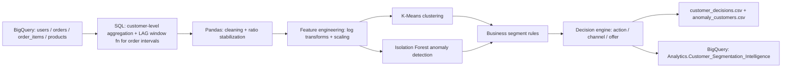

# E-Commerce Customer Segmentation & Decision Engine

**Unsupervised segmentation, anomaly detection, and a rule-based decisioning layer built end-to-end on Google BigQuery and Python — from raw transactional data to an activation-ready table written back into BigQuery.**

---

## Overview

This project turns raw order-level e-commerce data into a customer intelligence table that a marketing or CRM team could act on directly. It pulls ~10,000 customers' full purchase history from BigQuery, engineers behavioral (RFM-style) features in SQL and Python, clusters customers with K-Means, flags atypical accounts with Isolation Forest, and then layers a transparent, rule-based decision engine on top that assigns each customer a **business segment**, a **recommended action**, a **channel**, and an **offer value**. The final table is loaded back into BigQuery for downstream use.

The goal was to practice the full loop — extraction → cleaning → feature engineering → modeling → business translation → activation — rather than stopping at "here are some clusters."

## Business Problem

Generic, one-size-fits-all marketing wastes spend on customers who won't respond and under-serves the ones who would. The aim here was to move from *"send everyone the same email"* to a defensible, data-driven answer to two questions:

1. Which customers behave differently enough to warrant different treatment?
2. For each group, what's the specific next action — and can we justify it with numbers?

## Data Source

- **`bigquery-public-data.thelook_ecommerce`** — a public BigQuery sample dataset (`users`, `orders`, `order_items`, `products`)
- Aggregated from order-item level up to **one row per customer**, ranked by total revenue, sampled to 10,000 customers
- This is a public/synthetic dataset, not proprietary data — flagged here for transparency since that affects how much weight to put on the absolute numbers vs. the methodology

## Pipeline

### 1. Data extraction (SQL, BigQuery)

- Joined `users` → `orders` → `order_items` → `products`
- Used `LAG()` over each customer's order history to compute inter-purchase intervals
- Aggregated to customer level: total orders, total revenue, AOV, cancellation rate, order density, recency, favorite category/department/brand
- Computed baseline recency/frequency tags (`Active`/`Warm`/`Cooling`/`Dormant`, `One-time`/`Occasional`/`Frequent`) directly in SQL as a sanity-check layer before any modeling

### 2. Data cleaning (pandas)

- Dropped customers with no orders or zero/negative revenue
- Excluded customers with under 7 days of account lifespan — too new for rate-based metrics to mean anything
- Clipped lifespan at a 30-day floor before computing rate features, to stop very young accounts from producing exploding ratios

### 3. Feature engineering

- 7 base behavioral features (revenue, orders, AOV, recency, purchase cadence, monthly order rate, revenue/day)
- Log-transformed revenue, AOV, and order count to reduce right-skew → 10 features total
- Median imputation + standardization via an `sklearn` `Pipeline`

### 4. Clustering (K-Means)

Swept *k* from 2–8 and selected by silhouette score:

| k | Silhouette |
|---|---|
| 2 | 0.301 |
| 3 | 0.317 |
| **4** | **0.344** ← selected |
| 5 | 0.311 |
| 6 | 0.300 |
| 7 | 0.305 |
| 8 | 0.279 |

*k = 4* was the best fit, though a silhouette around 0.34 indicates moderate, not razor-sharp, cluster separation — worth being upfront about (see Limitations).

### 5. Anomaly detection (Isolation Forest)

Flagged the most atypical ~3% of customers (`contamination=0.03`) independent of the cluster assignment — these get pulled out and handled separately rather than forced into a segment.

### 6. Business segment labels (rule layer)

A second, human-readable layer sits on top of the model output and is what actually drives decisions: `Anomaly`, `Dormant`, `High Value – At Risk`, `Frequent Low Spenders`, `Active Core`, `Regular`. Keeping this as explicit rules (rather than just exposing raw cluster IDs) makes the segmentation explainable to a non-technical stakeholder.

### 7. Decision engine

Each business segment maps to a concrete next action:

| Business segment | Action | Channel | Offer |
|---|---|---|---|
| Anomaly | No action (review manually) | — | — |
| Dormant (>365 days inactive) | Win-back discount | Email | 25% |
| High Value – At Risk | VIP win-back offer | Email | 20% |
| Frequent Low Spenders | Bundle offer | Push | 10% |
| Active Core | Cross-sell | Email | 5% |
| Regular | No action | — | — |

### 8. Output

- `customer_decisions.csv` — full table with segment, action, channel, offer
- `anomaly_customers.csv` — isolated outliers
- Final table loaded to **`Analytics.Customer_Segmentation_Intelligence`** in BigQuery via `load_table_from_dataframe`, ready for a CRM or email tool to consume

## Key Findings — the Four Clusters

| Segment | Total Revenue (avg) | Orders (avg) | AOV (avg) | Days Since Last Order (avg) | Customer Lifespan (avg, days) | Monthly Order Rate | % Flagged Anomaly |
|---|---|---|---|---|---|---|---|
| 0 | $362.74 | 2.03 | $179.27 | 502.6 | 554.2 | 0.25 | 0% |
| 1 | $766.12 | 2.96 | $279.07 | 392.3 | 711.6 | 0.26 | 18% |
| 2 | $393.70 | 3.64 | $109.16 | 310.4 | 800.9 | 0.26 | 0% |
| 3 | $423.51 | 2.67 | $170.02 | 188.8 | 32.1 | 2.21 | 12% |

Reading the shape of each segment (interpretation, not ground truth — see Limitations):

- **Segment 0 — Lapsed/Dormant.** Lowest revenue, longest gap since last order, longest average gap *between* orders. These customers went quiet a while ago and haven't been highly engaged even when active.
- **Segment 1 — High-Value, Cooling.** Highest revenue and highest AOV by a clear margin, but still over a year since last purchase on average. This is the group where a win-back offer has the most $$ upside per customer — and it's also where most of the model's flagged anomalies sit, which makes sense: high-spend behavior naturally produces more outliers.
- **Segment 2 — Frequent, Low-Basket.** Most orders on average, but the lowest AOV and the longest tenure. Loyal, but each transaction is small — a good fit for bundling rather than discounting.
- **Segment 3 — New & Bursty.** Very short account lifespan (~32 days) but by far the highest order density and monthly order rate — these customers transacted intensely in a short window right after signing up. Worth watching whether that intensity sustains or whether it's a short-lived spike, since `days_since_last_order` (188.8) is already creeping up relative to how young the accounts are.

## Tech Stack

- **Data warehouse:** Google BigQuery (`bigquery-public-data.thelook_ecommerce`)
- **Language:** Python (pandas, numpy)
- **ML:** scikit-learn (`KMeans`, `IsolationForest`, `Pipeline`, `StandardScaler`, `SimpleImputer`), scipy.stats
- **Visualization:** matplotlib
- **Infra:** `google-cloud-bigquery`, `python-dotenv` for credential management

## How to Run

1. Set up a GCP service account with BigQuery read access and a `.env` file (or environment variables) pointing to your credentials and `GOOGLE_APPLICATION_CREDENTIALS`
2. `pip install -r requirements.txt`
3. Run the notebook top to bottom — it pulls fresh data from the public dataset, so results will shift slightly run to run as the underlying table doesn't change but sampling/`LIMIT` ordering can
4. Update `table_id` in the final cell to a BigQuery dataset you own before writing output

## Limitations & Future Work

- **Cluster separation is moderate, not crisp.** A silhouette score of ~0.34 means the four clusters are a reasonable summary of the data but overlap meaningfully — this is exploratory segmentation, not a guarantee that these are the "true" underlying customer types. Worth testing GMM or HDBSCAN as a comparison.
- **The 3% anomaly contamination rate is an assumption**, not validated against any labeled fraud/anomaly ground truth. Treat the anomaly list as "worth a human look," not "confirmed problem accounts."
- **Business-segment thresholds are heuristic** (e.g., the $200 AOV cutoff, the 365-day dormancy line). The natural next step is backtesting: did customers who actually got the win-back email come back at a higher rate than a control group?

